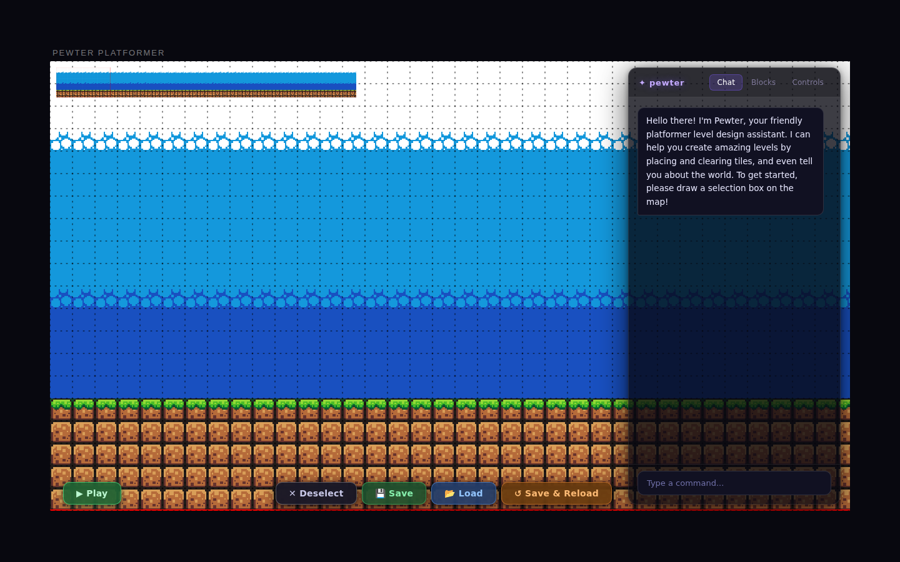
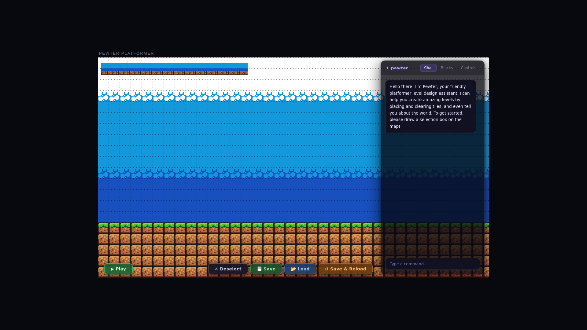
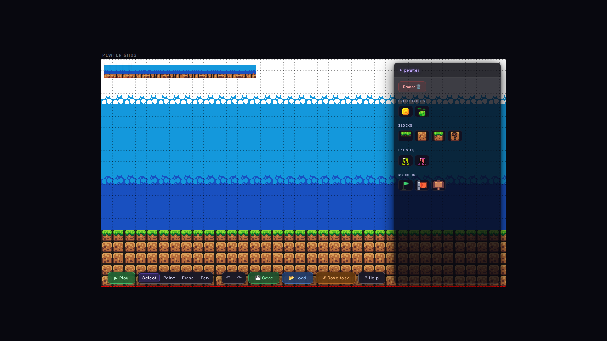
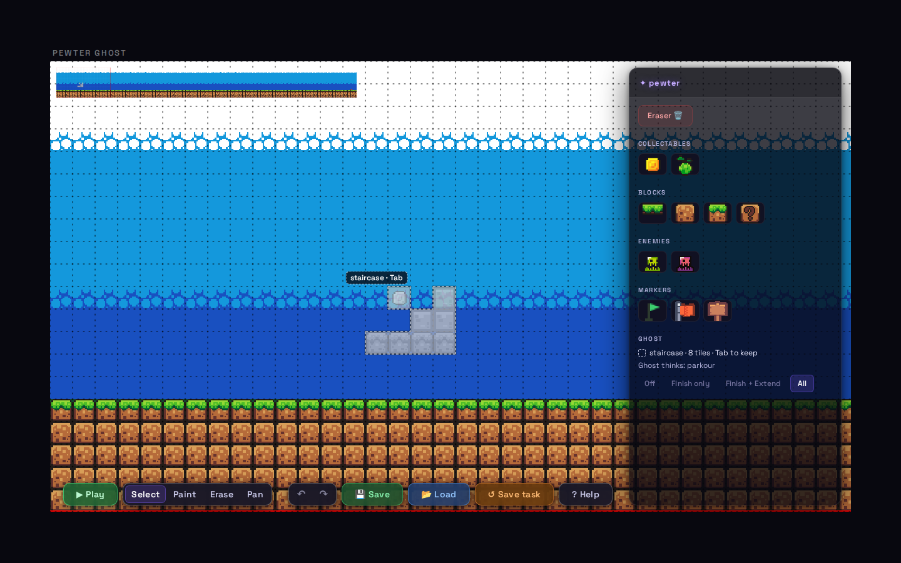
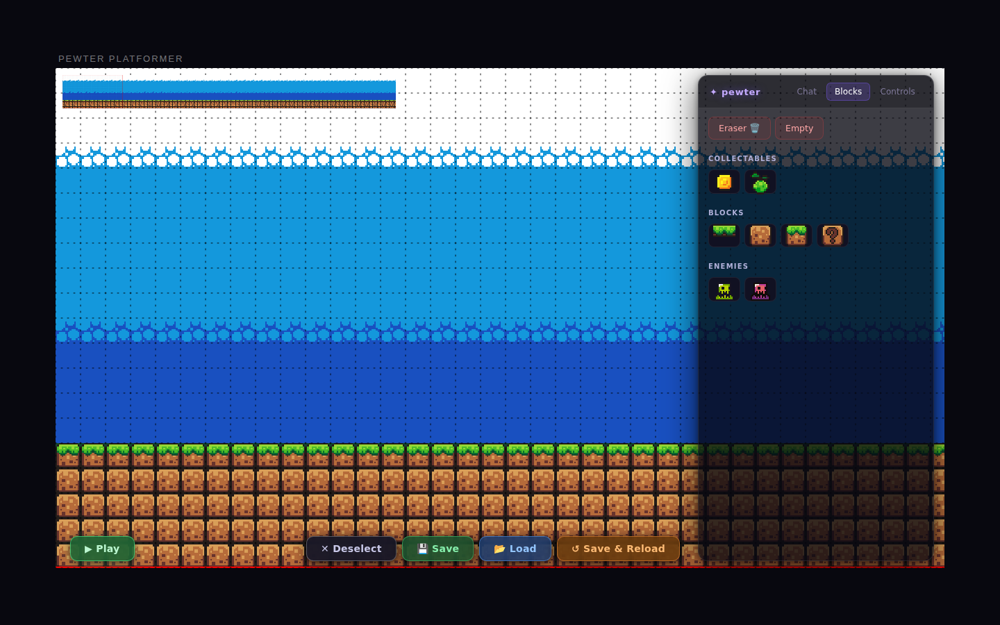
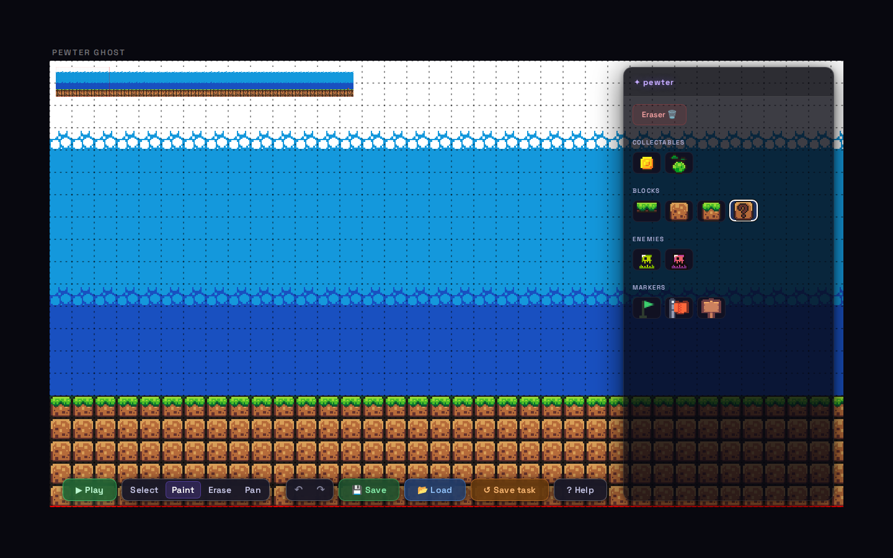
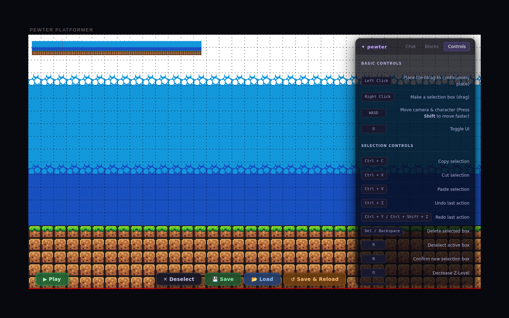
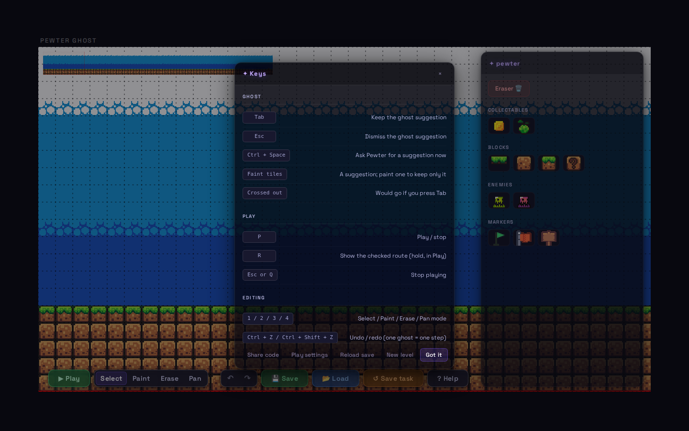
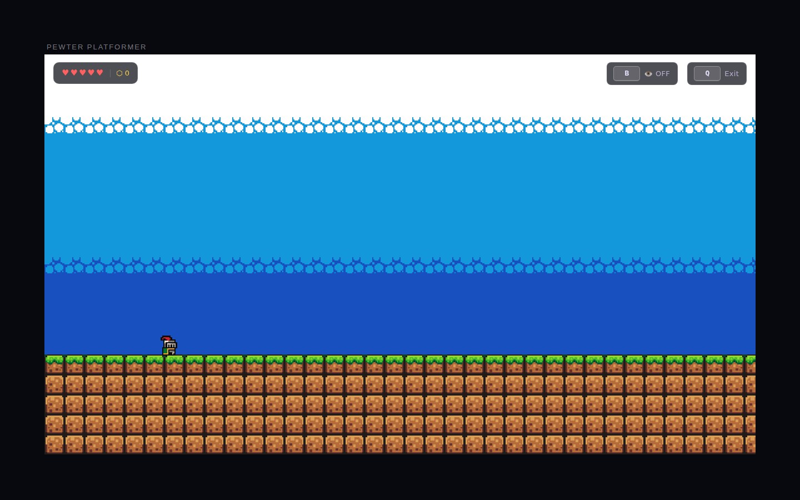
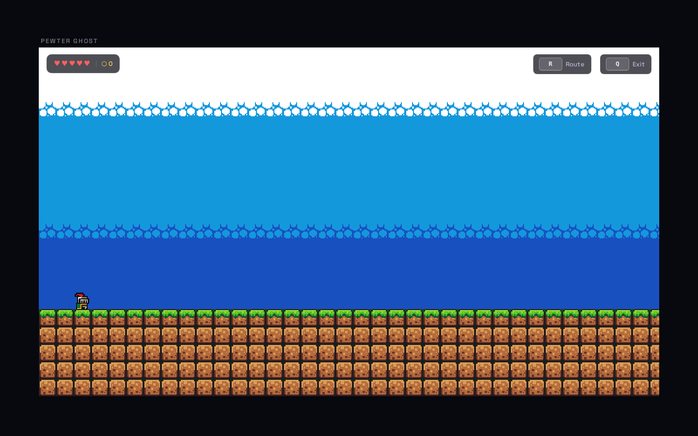

# Pewter Ghost look: old vs new

Pewter Ghost follows the Pewter Platformer look: the same page frame and title
label, the same canvas, panel and bottom toolbar, the same glass, type and
colours (copied from the old `UIScene.ts` and `chatbox.css`; see
[OLD_LOOK.md](OLD_LOOK.md) and [NEW_UI.md](NEW_UI.md)). What changed is what
[../PLAN.md](../PLAN.md) asks for: **no chat**, no selection boxes, and a ghost
on the canvas instead.

Final screenshots, 2026-10-08, Chromium at deviceScaleFactor 1. Old: Pewter
Platformer at `http://localhost:5301/Pewter-The-Platformer/`. New: Pewter Ghost
at `http://localhost:5330/?fresh=1` (AI off in an automated browser; the ghost
shot uses `?filler=stub` with a hand-made verified staircase ghost).

| View | Old (Pewter Platformer) | New (Pewter Ghost) |
| --- | --- | --- |
| Default, 1440x900 |  |  |
| Default, 1920x1080 |  |  |
| Ghost shown | (none: the old app had a Chat tab, not a ghost) |  |
| Blocks |  |  |
| Controls |  |  |
| Play mode |  |  |

## Deliberate differences

- **No chat.** The old panel opened on its Chat tab (chat log, typing
  indicator, chat input). Pewter Ghost has none of it: the canvas is the
  channel (PLAN "Keep, Fix, or Drop": chat dropped).
- **No tabs.** With Chat gone, the panel shows the Blocks content directly.
  There is no Ghost tab: the ghost lives on the canvas (faint grey tiles, a
  dashed outline and a small caption such as "staircase · Tab"), and the
  panel's last group, **Ghost**, holds one status line, the "Ghost thinks"
  guess and the Off / Finish only / Finish + Extend / All switch. The old
  Controls tab is replaced by **? Help**, a dialog in the old glass that lists
  the Ghost, Play and Editing keys.
- **Palette.** "Empty" (a selection-box tool) is gone from the eraser group. A
  **Markers** group (Start, Goal flag, Sign) follows Enemies; choosing Sign
  opens a "Sign text" group.
- **Toolbar.** "✕ Deselect" is gone (no selection boxes). Added: the four
  modes (Select / Paint / Erase / Pan) and Undo / Redo as two grouped pills,
  and "? Help". "↺ Save & Reload" is "↺ Save task".
- **Notices** are the old temporary message (amber italic, fades after 3 s) at
  the panel's foot, not chat bubbles.
- **Title label** reads "PEWTER GHOST".
- **Play HUD.** "R Route" (hold to show the checked route) replaces the old
  "B" debug toggle; hearts, coins and "Q Exit" are as before.
